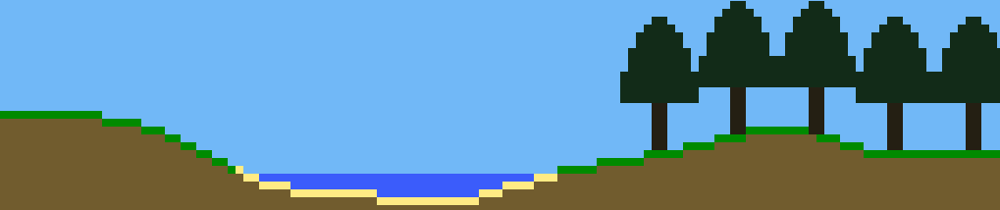

# Into the Woods
> A game about a quest from the office to the woods

You reach your third decade working in your office job, and you can't do it anymore. So, you leave everything and everyone you know and enter the wilderness...

## Overview

Into the Woods is an open-world tile-based game, where spending enough time in the woods means winning the game. See the WIP [design doc](DESIGN.md) for more info.

## Installation

There are currently no releases of the game, as it is in very early development.

<!--## Screenshots-->

## Development setup

This game is built in the [Godot game engine][godot], so you will need that installed. Then, just clone and start open-sourcing. The game's developer documentation can be found [here](/docs).

<!--## Release History

* 0.2.1
    * CHANGE: Update docs (module code remains unchanged)
* 0.2.0
    * CHANGE: Remove `setDefaultXYZ()`
    * ADD: Add `init()`
* 0.1.1
    * FIX: Crash when calling `baz()` (Thanks @GenerousContributorName!)
* 0.1.0
    * The first proper release
    * CHANGE: Rename `foo()` to `bar()`
* 0.0.1
    * Work in progress-->

## Community

Feel free to join [the Discord server][discord server]!

## Meta

Caleb Sacks – [@clabe45](https://twitter.com/clabe45)
<!-- your name here -->

Distributed under the GNU GPLv3 license. See ``LICENSE`` for more information.

## Contributing

1. Fork it (<https://github.com/prophets-of-tron/into-the-woods/fork>)
2. Create your feature branch (`git checkout -b feature/fooBar`)
3. (Optional) Discuss your changes with someone on the Discord server.
4. Commit your changes (`git commit -am 'Add some fooBar'`, [commit message emoji guide](http://gitmoji.carloscuesta.me/))
5. Push to the branch (`git push origin feature/fooBar`)
6. Create a new Pull Request

<!-- Markdown link & img dfn's -->
<!--[npm-image]: https://img.shields.io/npm/v/datadog-metrics.svg?style=flat-square
[npm-url]: https://npmjs.org/package/datadog-metrics
[npm-downloads]: https://img.shields.io/npm/dm/datadog-metrics.svg?style=flat-square
[travis-image]: https://img.shields.io/travis/dbader/node-datadog-metrics/master.svg?style=flat-square
[travis-url]: https://travis-ci.org/dbader/node-datadog-metrics
[wiki]: https://github.com/yourname/yourproject/wiki-->

[godot]: https://godotengine.org/
[discord server]: https://discord.gg/RwvBmrd
